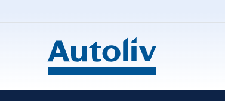

# Autoliv Shift Manager

Instrument intern (desktop + TV dashboard) pentru planificarea schimburilor si afisarea programului in timp real in fabrica.

## Status

**Production-ready internal tool** (utilizare interna Autoliv).

## Badges


## Imagini (Screenshots)

Logo:



## Functionalitati (Features)

1. Login + management utilizatori (admin).
2. Planner desktop pentru asignari pe departamente / zile / schimburi.
3. Publicare program (live) si mecanisme de backup/recuperare.
4. TV dashboard web (LAN) cu refresh automat si paginare pe moduri (Magazie/Bucle).
5. Validari pentru reguli 8h/12h si consistenta datelor.

## Arhitectura (Overview)

* `logic/`: logica domeniu, persistenta JSON, validari, utilitare.
* `ui/`: interfata desktop (CustomTkinter/Tkinter).
* `templates/`: template-uri HTML pentru TV dashboard.
* `tv_server.py`: server FastAPI pentru TV dashboard (`/tv`, `/api/tv-data`).
* `tests/`: suită de teste (unit + QA/stress).
* `data/`: date runtime locale (in mare parte ignorate in git).
* `.github/workflows/`: CI (ruff + pytest).

## Securitate (Highlights)

* Fisiere sensibile sunt pastrate in `data/` si ignorate in git (ex. `data/users.json`).
* API key poate fi folosit pentru a proteja endpoint-urile TV; daca nu este setat, TV ruleaza neautentificat in retea interna (comportament controlat din config).

## Testare (Highlights)

* CI ruleaza `ruff check .` si `pytest`.
* Suita include teste de integritate/recuperare fisiere si verificari de consistenta pentru schedule store.

## Rulare (Dev)

```powershell
python -m venv .venv
.\.venv\Scripts\pip install -r requirements.txt
.\.venv\Scripts\pip install -r requirements-dev.txt
.\.venv\Scripts\python main.py
```

## TV Dashboard (Dev)

```powershell
.\.venv\Scripts\python main.py --tv-web
```

Deschide in browser:

* Local: `http://127.0.0.1:8000/tv`
* Retea: `http://<LAN_IP>:8000/tv`

## Build EXE (PyInstaller)

Build onefile:

```powershell
.\build_exe_onefile.cmd
```

Verify the built `dist` folder:

```powershell
.\verify_build.cmd
```

Spec:

* `Autoliv_Shift_Manager_Onefile.spec`

## Operare productie locala

* Release checklist: `docs/RELEASE_CHECKLIST.md`
* Backup si restore: `docs/BACKUP_AND_RESTORE.md`
* Support runbook: `docs/SUPPORT_RUNBOOK.md`
* Backup extern optional: `external_backup.cmd "D:\Autoliv_Backups"`
* Pachet suport sanitizat: `generate_support_bundle.cmd`

## Structura Proiectului

```
assets/
data/
logic/
templates/
tests/
ui/
.github/workflows/
main.py
tv_server.py
Autoliv_Shift_Manager_Onefile.spec
```
